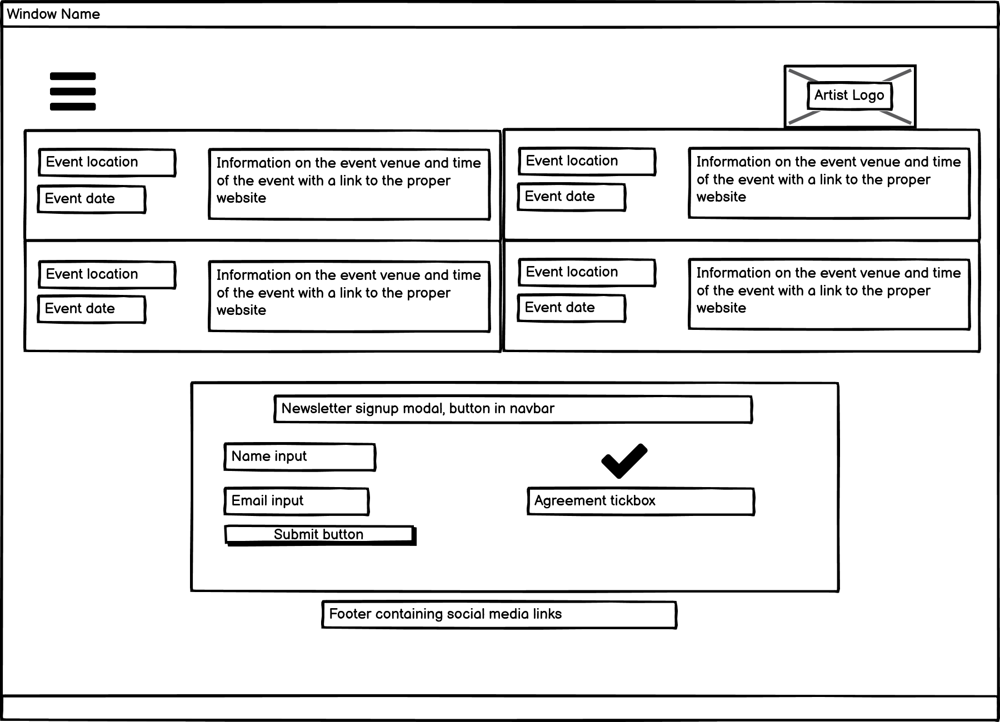

# Milestone-Project-1
My first Code Institute milestone project concerning User Centric Frontend Development

## Table Of Contents
* [Purpose of the website](#purpose-of-the-website)
* [User Experience (UX)](#user-experience-design)
    * [User Stories](#user-stories)
    * [Structure](#structure)
    * [Design and Wireframes](#design-and-wireframes)
* [Imported and Borrowed Features](#imported-and-borrowed-features)
    * [Custom Alterations to Borrowed Features](#custom-alterations-to-borrowed-features)
* [Features](#features)
* [Testing and Bug Fixes](#testing-and-bug-fixes)
* [Credits](#credits)

## Purpose of the website
This website has been developed as part of my Code Institute Full Stack Developer Course, and will act as my first Milestone Project for the User Centric Frontend module. 
I have designed this website using my knowledge of HTML and CSS, with any borrowed features referenced in a section of this document.
### User Experience Design
#### User Stories
##### As a first time visitor:
- As a first time visitor, I want to easily navigate this website
- As a first time visitor, I want there to be content pertaining to the artist's online presence through social media
- As a first time visitor, I want to be able to use this website comfortably on any of my devices

##### As a returning visitor:
- As a returning visitor, I want to see details of shows and access tickets for entry to them
- As a returning visitor, I want to access up-to-date information on the artist's releases

##### As a frequent visitor
- As a frequent visitor, I want to see if the artist is working on any new releases that I can expect soon
- As a frequent visitor, I want to sign up to a newsletter to keep abreast of the artist's releases and shows and any message the artist wishes to convey to fans

#### Structure
 The purpose of this is to fulfill user story:
The website is contained within a single page, with a navbar containing hyperlinks attached to the top of the screen. The navbar is collapsible for small and medium devices such that space can be saved while maintaining functionality. The purpose of this is to fulfill user story:
> As a first time visitor, I want to easily navigate this website

The website also has a footer attached to the bottom of the screen with a number of links to the artist's social media pages and streaming services. The purpose of this is to fulfill user story:
> As a first time visitor, I want there to be content pertaining to the artist's online presence through social media

The website is designed with responsivity in mind, creating an easy-on-the-eye bootstrap based layout at all screen sizes. The purpose of this is to fulfill user story:
> As a first time visitor, I want to be able to use this website comfortably on any of my devices

The website has a section containing the artist's next upcoming shows at the bottom of the webpage, with a link in the navbar for ease of access. The purpose of this is to fulfill user story:
> As a returning visitor, I want to see details of shows and access tickets for entry to them

#### Design and Wireframes

## Imported and Borrowed Features

### Custom Alterations to Borrowed Features
## Features

## Testing and Bug Fixes

## Credits