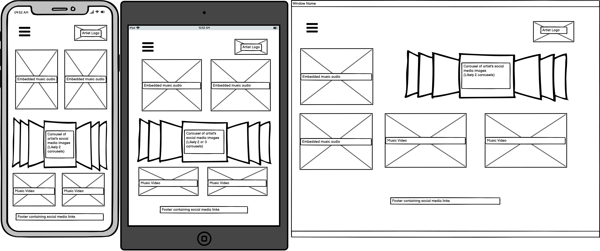

# Milestone-Project-1
My first Code Institute milestone project concerning User Centric Frontend Development

## Table Of Contents
* [Purpose of the website](#purpose-of-the-website)
* [User Experience (UX)](#user-experience-design)
    * [User Stories](#user-stories)
    * [Structure](#structure)
    * [Design and Wireframes](#design-and-wireframes)
* [Features](#Features)
    * [Existing Features](#existing-features)
    * [Future Features](#future-features)
* [Technologies](#Technologies)
* [Testing and Bug Fixes](#testing-and-bug-fixes)
* [Deployment](#deployment)
    * [Project Creation](#project-creation)
    * [GitHub Pages](#using-github-pages)
    * [Locally](run-locally)
* [Credits](#credits)

## Purpose of the website
This website has been developed as part of my Code Institute Full Stack Developer Course, and will act as my first Milestone Project for the User Centric Frontend module. 
I have designed this website using my knowledge of HTML and CSS, with any borrowed features referenced in a section of this document.
The website can be accessed [here](https://willdeakin.github.io/Milestone-Project-1/).
### User Experience Design
#### User Stories
##### As a first time visitor:
- As a first time visitor, I want to easily navigate this website
- As a first time visitor, I want there to be content pertaining to the artist's online presence through social media
- As a first time visitor, I want to be able to use this website comfortably on any of my devices

##### As a returning visitor:
- As a returning visitor, I want to see details of shows and access tickets for entry to them
- As a returning visitor, I want to access up-to-date information on the artist's releases

##### As a frequent visitor
- As a frequent visitor, I want to keep up to date on the artist's social media posts
- As a frequent visitor, I want to sign up to a newsletter to keep abreast of the artist's releases and shows and any message the artist wishes to convey to fans

#### Structure
 The purpose of this is to fulfill user story:
The website is contained within a single page, with a navbar containing hyperlinks attached to the top of the screen. The navbar is collapsible for small and medium devices such that space can be saved while maintaining functionality. The purpose of this is to fulfill user story:
> As a first time visitor, I want to easily navigate this website

The website also has a footer attached to the bottom of the screen with a number of links to the artist's social media pages and streaming services. The purpose of this is to fulfill user story:
> As a first time visitor, I want there to be content pertaining to the artist's online presence through social media
> As a frequent visitor, I want to keep up to date on the artist's social media posts

The website is designed with responsivity in mind, creating an easy-on-the-eye bootstrap based layout at all screen sizes. The purpose of this is to fulfill user story:
> As a first time visitor, I want to be able to use this website comfortably on any of my devices

The website has a section containing the artist's next upcoming shows at the bottom of the webpage, with a link in the navbar for ease of access. The purpose of this is to fulfill user story:
> As a returning visitor, I want to see details of shows and access tickets for entry to them

The website features the artist's latest major release at the top of the website and a carousel of the artist's works with links to them. The purpose of this is to fulfill user story:
> As a returning visitor, I want to access up-to-date information on the artist's releases

The website features a button in the navbar to sign up. This brings up a modal which can be filled in with contact details to this end. The purpose of this is to fulfill user story:
> As a frequent visitor, I want to sign up to a newsletter to keep abreast of the artist's releases and shows and any message the artist wishes to convey to fans
#### Design and Wireframes
##### Colour Scheme
I have used colours taken from the artist's debut album art, his largest and most popular work to date, to create the colour scheme. These include primarily white  for the text, blue crayola  for nav and footer text, and rich black  for the background.

##### Typography
I have used the same 2 fonts throughout the website; Exo for the navbar and roboto slab for the body.

##### Images
I have used a number of images from the artist's album arts and from articles written about the artist. The images are mostly used in carousels in the body of the website in a 1:1 ratio. I also used a few youtube videos through the website from the artist's youtube channel.

##### Wireframes
I have grouped my wireframes into sections below, with each set consisting of a small, mid and large sized screen.

Home Section

About Section

Showcase Section

Shows Section

This section includes an idea of what my modal for the signup button in the navbar should look like at the bottom. This is simply because my show section is the shortest and I wanted to include this modal in the wireframes, it doesn't represent the placement of my modal relative to the webpage.

To access these wireframes seperately, click the links below:
* [Home Section Wireframe](assets/wireframes/home_wireframes.png)
* [About Section Wireframe](assets/wireframes/about_wireframes.png)
* [Showcase Section Wireframe](assets/wireframes/showcase_wireframes.png)
* [Shows Section Wireframe](assets/wireframes/shows_wireframes.png)

##### Divergences from my wireframes
In the home section, my wireframe showed all the features contained on 1 line, which I decided to change to have 2 lines of content. I did this to achieve a more pleasing layout.

In the showcase section, my wireframe showed multiple carousels for the artist's images, which I omitted in favour of just showing 1 carousel. I did this to keep the layout of the webpage more simple and because multiple carousels in the same section seemed redundant.

## Features

### Existing Features
- The signup button in the navbar brings up a newsletter sign up modal.
- In the home and showcase sections are embeded YouTube videos which can be played.
- In the about section is a short timeline of the artist's career milestones, which only appears on large screens.
- In the about and showcase sections are 2 carousel galleries showing pictures of the artist and of his cover arts. These are implemented to cycle through automatically and showcase more of the artist while saving space and keeping an appealling layout.
- In the showcase section there are 2 embedded spotify music players with album art attached to the top for layout, which can be played.
- In the shows section, there are extra shows added at large screen sizes for the format.
### Future Features

## Technologies
* HTML
    * This project uses HTML for the structure and content of the site.
* CSS
    * This project uses a custom CSS file to style the site.
* [Bootstrap](https://getbootstrap.com/docs/4.6/getting-started/introduction/)
    * This project uses Bootstrap CSS and JS to style the site and add layout and various functionalities such as buttons.
* [Fontawesome](https://fontawesome.com/)
    * This project uses Fontawesome to add icons in the site.
* [Google fonts](https://fonts.google.com/)
    * This project uses Google fonts to style the text in the site.
* [Hover effects](https://cdnjs.com/libraries/hover.css/2.1.1)
    * This project uses Hover effects to style the text and icons in the site.
* [Balsamiq Wireframes](https://balsamiq.com/wireframes/?gclid=CjwKCAiA9bmABhBbEiwASb35Vz5eNriDRNqnP0yfLYeqI0aYF9r5Qf45QNEoXootlZ-VmwSloDl8rRoCdbcQAvD_BwE)
    * Balsamiq Wireframes were used to create wireframes for UX design.
* [Github](https://github.com/)
    * This project uses Github as the hosting site, which stores the code and deploys the site through [Gitpages](https://pages.github.com/).
* [Coolors](https://coolors.co/)
    * This project uses a colour scheme developed from the artist's album art through Coolors.

## Testing and Bug Fixes
This webpage is front end oriented, and as such will be tested for its layout and responsiveness across browsers and page sizes. 
Testing will be done across google chrome, mozilla firefox and microsoft edge at small (phone), medium (tablet/notebook) and large (any larger screen) sizes.

To be considered successful, in each browser and at each size the webpage should;
- Contain working and correct hyperlinks, both internal and external, with external links opening in a fresh tab.
- Have no overlapping divs/ sections such that the layout is compromised.
- Display a similar layout as to the wireframes provided above, with the exception of changes in layout design mentioned alongside the wireframes.
- Contain working windows such as youtube videos and carousels.

Each browser should fulfill the following test cases upon testing:

| Test Description  	|   Shorthand Reference	|
|---	|---	|
|   Layout should be preserved at all window sizes	|  TC1 	|
|  All external links should be in correct working order and create a fresh tab 	|   TC2 |
|  All internal links should be in correct working order 	|   TC3 |
|  All carousels should cycle through automatically and be manually operable 	|   TC4	|
|  All hover effects and color changes should be in working order 	|   TC5	|

#### TC1

Testing process:
- Open website in the tested browser
- Right click and inspect element
- Change device width for each size class (small, medium and large)

Test case results for each browser:
- Google chrome - Testing all 3 size classes, the webpage acted as desired and passed.
- Microsoft edge - Testing all 3 size classes, the webpage acted as desired and passed.
- Mozilla firefox - Testing all 3 size classes, the webpage acted as desired and passed.

#### TC2

Testing process:
- Open website in the tested browser
- Left click each external link in the website
- Confirm each link creates a new tab with the desired hyperlink

Test case results for each browser:
- Google chrome - Upon first try, realised that an external link wasn't written to open in a fresh window. Made the necessary fix, first test was a fail but upon retest was a pass.
- Microsoft edge - As this test was conducted after the chrome test, the fix was made and the first test was a pass.
- Mozilla firefox - As this test was conducted after the chrome test, the fix was made and the first test was a pass.

#### TC3

Testing process:
- Open website in the tested browser
- Left click each nav element
- Confirm each nav link brings one to the desired section

Test case results for each browser:
- Google chrome - All nav elements took the page to the desired section, this was a pass.
- Microsoft edge - All nav elements took the page to the desired section, this was a pass.
- Mozilla firefox - All nav elements took the page to the desired section, this was a pass.

#### TC4

Testing process:
- Open website in the tested browser
- Observe whether the carousel automatically cycles through the images
- Left click the left and right arrows to confirm that manual cycling works as desired

Test case results for each browser:
- Google chrome - Both carousels were automatically cycling through the images, with the arrows operable for manual control, this was a pass.
- Microsoft edge - Both carousels were automatically cycling through the images, with the arrows operable for manual control, this was a pass.
- Mozilla firefox - Both carousels were automatically cycling through the images, with the arrows operable for manual control, this was a pass.

#### TC5

Testing process:
- Open website in the tested browser
- Hover over each element with a hover effect/ color change
- Confirm each hover sensitive element is effected as desired

Test case results for each browser:
- Google chrome - All nav elements and footer icons acted as desired when hovered over, this was a pass.
- Microsoft edge - All nav elements and footer icons acted as desired when hovered over, this was a pass.
- Mozilla firefox - All nav elements and footer icons acted as desired when hovered over, this was a pass.

The HTML Page was validated using the [W3C Markdown Validator](https://validator.w3.org/nu/#textarea) and showed no errors, but 2 warning appeared regarding sections with no headings at the beginning. I decided not to act on these, as I think no headings for these 2 sections are more visually appealing.

The CSS Page was validated using the [W3C CSS Validator](https://jigsaw.w3.org/css-validator/validator) and showed no errors or warnings.

- As a first time visitor, I want to easily navigate this website - testing was performed to ensure that sections had a clear purpose through headings and content, and were easy to follow.
- As a first time visitor, I want there to be content pertaining to the artist's online presence through social media - testing was performed on all external links to ensure the artist's social media was available and easy to access.
- As a first time visitor, I want to be able to use this website comfortably on any of my devices - testing was performed on a variety of screen sizes to ensure ease of access and responsivity on all devices.

- As a returning visitor, I want to see details of shows and access tickets for entry to them - testing was performed to ensure that upcoming show details were included in the webpage and were clearly presented.
- As a returning visitor, I want to access up-to-date information on the artist's releases - testing was performed to ensure that the latest and most popular releases from the artist were clearly represented on the webpage.

- As a frequent visitor, I want to keep up to date on the artist's social media posts - testing was performed on all external links to ensure the artist's social media was available and easy to access.
- As a frequent visitor, I want to sign up to a newsletter to keep abreast of the artist's releases and shows and any message the artist wishes to convey to fans - testing was performed to ensure that there was a clear form that could be filled in to sign up to the artist's newsletter.

#### Notable bug fixes during coding and testing

- The link to the artist's show booking website didn't open in a new window, this was resolved during testing.
- There were multiple issues with formatting the images, which was solved by placing them in containers and having them fill the container.
- The embedded spotify music windows were acting seperately to the images attached above, this was fixed by aligning them both centrally and assigning the same width values.
- The embedded youtube windows were formatting with a short height, meaning they were essentially inoperable, which was fixed by adding a min-height.

## Deployment

### Project Creation
This project was created in its own repository using Github under my account name. It is named Willdeakin/Milestone-Project-1 and contains all the necessary files to run the website.

I used Gitpod to write and edit these files, using the bash terminal for saving, updating and version control of the project. For the purpose of this project, I used these commands:
- git add -A; to add all files to the staging area
- git commit -m "*message detailing the changes from the last version*"; to commit changes from the staging area to the local repository
- git push; to push committed changes from the local repository to the Github repository

### Using GitHub Pages
- Access the GitHub repository [here](https://github.com/Willdeakin/Milestone-Project-1/).
- Click the Settings tab in the tabs menu.
- Scroll to the Github Pages section.
- Make sure that the branch selected is main; it should already be selected, if not this should be saved with the button just next to the branch dropdown.
- Click the link on the first line, which should read 'https://willdeakin.github.io/Milestone-Project-1/'
### Run Locally
- Access the GitHub repository [here](https://github.com/Willdeakin/Milestone-Project-1/).
- Click the Code dropdown.
    - Download the ZIP file, which can be unpackaged and opened with an IDE.
- Or 
    - Copy Git URL (there is a handy clip button next to the URL).
    - Open a development editor and a terminal window within the directory.
    - Use 'git clone' in the terminal followed by the copied URL.
    - You now have a copy of the project in your directory.

## Credits
- Code
    * [Horizontal Timeline](https://www.bootdey.com/snippets/view/simple-horizontal-timeline#css)
        - The code for the horizontal timeline in the about section is copied and pasted then adapted from this source into my HTML and custom CSS files.
    * [Navbar Icon Colour Changer](https://www.geeksforgeeks.org/how-to-change-hamburger-toggler-color-in-bootstrap/)
        - The code used to change the colour of the hamburger nav icon in the navbar is copied and pasted then adapted from this source into my custom CSS file.
    * [Block Dividers](https://github.com/Willdeakin/bootstrap4)
        - The code used to implement block divider lines between paragraphs in the home section and signup modal is copied and pasted then adapted from a previous Code Institute project into my custom CSS file.
    * [Footer](https://github.com/Willdeakin/resume-project)
        - The code used to create the basis for the footer is copied and pasted then adapted from a previous Code Institute project into my HTML file.
    - The code of this project was created by Will Deakin.

- Content
    - The content of this project was created by Will Deakin.

- Media
    - The media used in this project is sourced from the artist's social media, published works and from online publications.